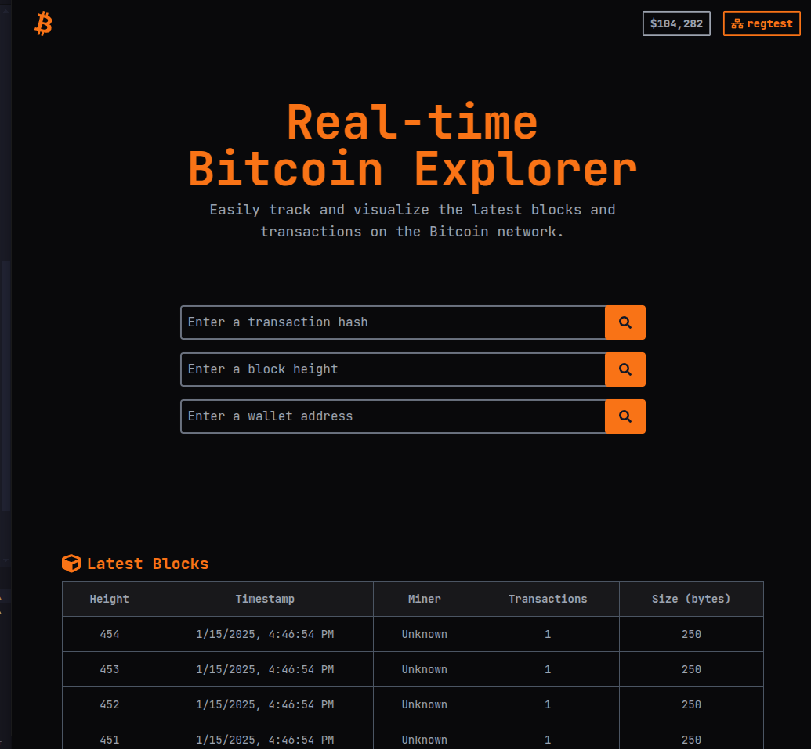
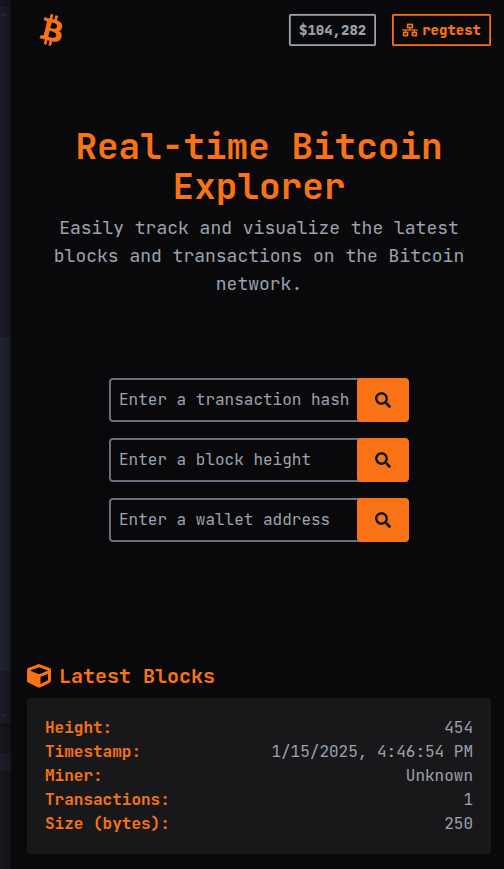
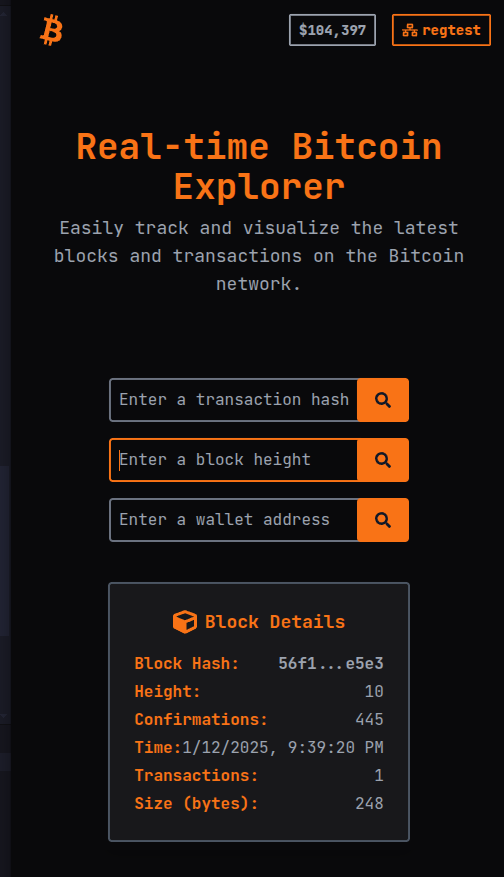

# Bitcoin Explorer - Dojo Bitcoin Nearx

This project is a real-time Bitcoin Explorer. The application connects to a Bitcoin node running on the Bitcoin regtest and provides features to explore blockchain data and wallet balances.

#### Live Demo

Check out the live deployment of this project: **[Bitcoin Explorer](https://btc-explorer.vercel.app/)**

## Features

- **Deploy a Bitcoin Node**: The Bitcoin node runs on the regtes, deployed in a AWS cloud service.
- **Block Search**: Retrieve a block using its number.
- **Transaction Search**: Retrieve details of a transaction using its hash.
- **Wallet Balance**: Display the balance of a wallet based on its address.

## Tech Stack

- **Frontend Framework**: [Vite](https://vitejs.dev/), [React](https://react.dev/) + [TypeScript](https://www.typescriptlang.org/)
- **Styling**: [TailwindCSS](https://tailwindcss.com/)
- **Backend**: [Bitcoin Core RPC](https://developer.bitcoin.org/reference/rpc/index.html)

## Installation

1. Clone the repository:
   ```bash
   git clone https://github.com/your-username/bitcoin-explorer.git
   cd bitcoin-explorer
   ```

2. Install dependencies:
   ```bash
   npm install
   ```

3. Start the development server:
   ```bash
   npm run dev
   ```

## Usage

- **Search Blocks**: Enter a block number to retrieve its details.
- **Search Transactions**: Input a transaction hash to view its information.
- **Wallet Balance**: Enter a Bitcoin address to see the wallet's balance.

## Screenshots

<p align="center">
  
</p>
<p align="center">
  
  
</p>


## Roadmap


The next steps:
- refactor the code
- create backend
- add new features
- combine the three inputs into a single one to improve the user experience.


## Contributing

Contributions are welcome! Please open an issue or submit a pull request to suggest changes or improvements.

## License

This project is licensed under the MIT License. See the [LICENSE](./LICENSE) file for details.

---

